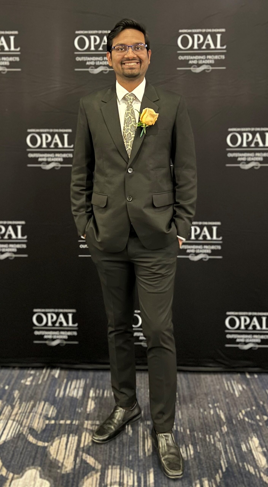

 
    

 <b>Ashray Saxena, PhD Student</b>

 <em>Graduate Research Assistant</em>, <a href="https://caee.utexas.edu/" target="blank">Department of Civil Engineering</a> 
 
<a href="https://utexas.edu" target="blank">The University of Texas at Austin</a>

 

I am completing my Ph.D. in Civil Engineering at [The University of Texas at Austin](https://www.utexas.edu/) with a specialization in Geotechnical Engineering (geosynthetics, transportation geotechnics, pavement materials characterization, biopolymer-based soil stabilization, and experimental and statistical modeling of geomaterials), with [Prof. Jorge G. Zornberg](https://sites.utexas.edu/zornberg/) ([Maseeh Department of Civil, Architectural and Environmental Engineering](https://caee.utexas.edu/)) serving as my principal advisor. Along the way I earned an M.S. in Civil Engineering from UT Austin (2025) with a focus on Transportation Geotechnics.

Prior to Texas, I completed my M.Tech in Civil Engineering at the [Indian Institute of Technology (IIT) Gandhinagar](https://iitgn.ac.in/) (2019 - 2021), working with [Dr. Ajanta Sachan](https://iitgn.ac.in/faculty/civil/fac-ajanta) on the effect of guar gum biopolymer on the shear strength, cyclic, and durability response of Class-F fly ash — work for which I received the Institute Gold Medal. I obtained my B.Tech (2019) and Diploma (2015) in Civil Engineering from [Aligarh Muslim University](https://www.amu.ac.in/), where I worked with [Dr. M. Shariq](https://www.amu.ac.in/faculty/civil-engineering/mohd-shariq-1) on the performance of concrete incorporating recycled coarse aggregate and bottom ash, and received the Institute Silver Medal.

Since 2022 I have been a Graduate Research Assistant at UT Austin, leading projects sponsored by the [Texas Department of Transportation (TxDOT)](https://www.txdot.gov/) and industry on geosynthetic-reinforced asphalt. This work includes the development of the Cross-Shear Test as a new method for evaluating reinforced asphalt under shear loading, Digital Image Correlation analysis of crack initiation and propagation, evaluation of the millability and recyclability of asphalt containing paving interlayers, and field monitoring and specification development for reinforced asphaltic layers. Alongside this, I have mentored M.S. students and visiting doctoral scholars, served as a teaching assistant across geoenvironmental engineering, soil mechanics, cost estimating, and calculus, and remain active in the profession as an IGS Young Members Committee representative, an ASCE Texas Younger Member Committee representative, and a technical session chair for the Geosynthetics Conference 2027.

My broader research interest lies at the interface of sustainable geomaterials and infrastructure performance, spanning three connected threads. The first is transportation geotechnics, where I study geosynthetic-reinforced asphalt and the recyclability of pavement materials. The second is ground improvement and geoenvironmental engineering, including the stabilization of fly ash, pond ash, and expansive soils using biopolymers such as guar gum and xanthan gum, the beneficial reuse of water treatment plant sludge as subgrade material, and geosynthetic encasement of stone columns. The third is sustainable construction materials, where I have examined recycled coarse aggregate, coal bottom ash, and high-volume fly ash and geopolymer concretes, including their behavior at elevated temperatures. Across all three, I combine laboratory and microstructural characterization, field validation, and predictive statistical modeling to make infrastructure more durable, recyclable, and resilient while diverting industrial waste streams from disposal.

