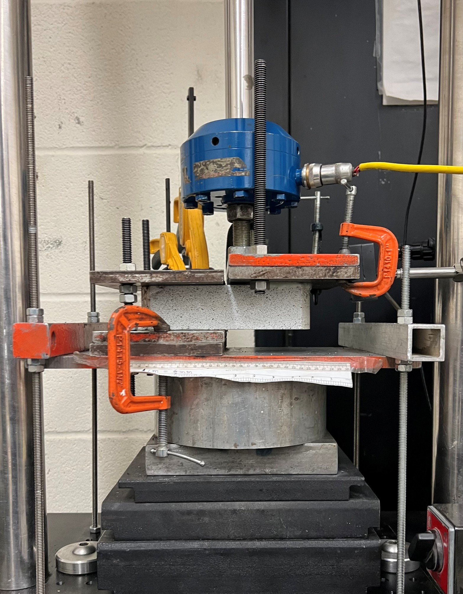
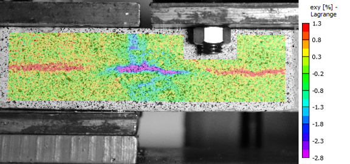
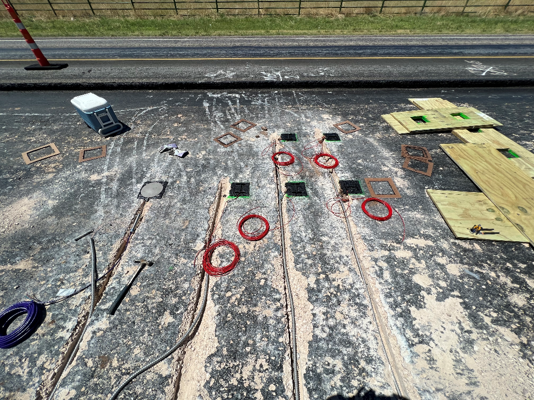
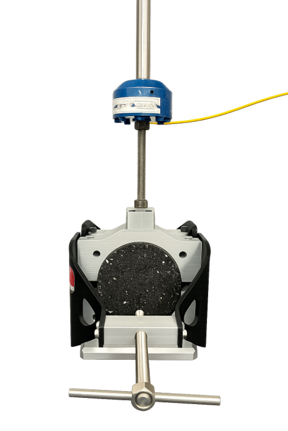
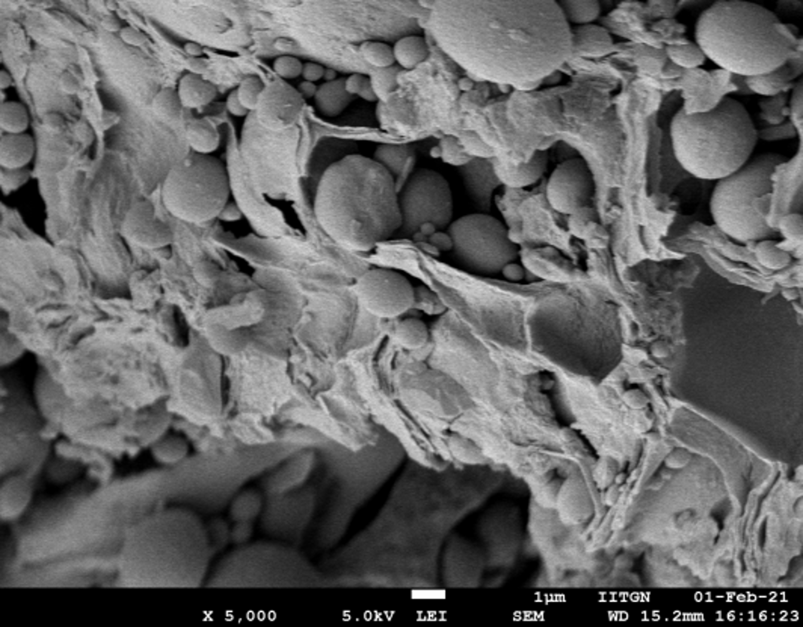
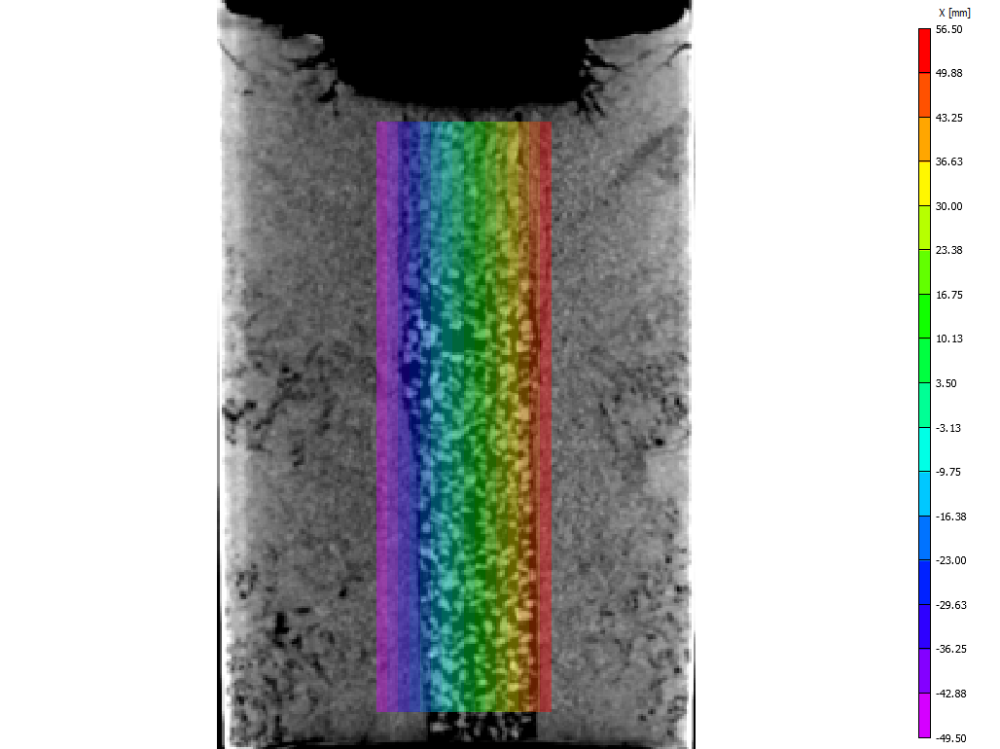

## Research highlights

<!-- I define myself as a mathematical engineer and computational scientist. My work focuses on advancing our understanding of physical and biological phenomena, improving the design of engineering systems, and supporting informed decision-making under uncertainty by use of mathematical/statistical modeling and high-performance computing. An important component of my work is the systematic integration of mathematical models and data (e.g., experimental measures and images) using the Bayesian framework. Throughout my career, I have led the development of novel formulations and algorithms for the solution of both forward and inverse problems. I have achieved this by establishing a close working collaboration with some of the leading research experts in the fields of medical imaging, geophysics, engineering, computational sciences, and applied mathematics.-->

My research interests and expertise are in geotechnical engineering and transportation geotechnics, with an emphasis on the mechanical characterization of geosynthetic-reinforced pavements and the sustainable stabilization of industrial by-products. My work is shaped by transdisciplinary training that spans experimental mechanics, pavement and geomaterials characterization, full-field optical measurement, and statistical and machine-learning-based modeling — and it moves deliberately between the laboratory bench, the instrumented field section, and the design specification. My ultimate goal is to extend the service life of transportation infrastructure while reducing the material and carbon burden of building it, so that agencies can adopt reinforcement and recycling technologies on the strength of quantitative evidence rather than empirical precedent. My research develops new test methods, mechanistic understanding, and predictive models to 1) Quantify how geosynthetic interlayers retard reflective cracking in asphalt overlays under shear, thermal, and traffic-induced loading; 2) Establish the millability and recyclability of geosynthetic-reinforced asphalt, so that reinforcement does not come at the cost of end-of-life recovery; 3) Convert industrial and municipal by-products — fly ash, bottom ash, recycled concrete aggregate, and water-treatment sludge — into engineered geomaterials through biopolymer and chemical stabilization. I am playing a leading role in several projects that standardize the cross-shear test as a repeatable method for evaluating geosynthetic-reinforced asphalt, apply digital image correlation to resolve crack initiation and propagation at the reinforcement interface, and translate laboratory findings into field monitoring protocols and specifications for state highway agencies.

During my master's programs, I made several contributions to the characterization and beneficial reuse of coal combustion residues and construction waste. These included establishing the effect of guar gum biopolymer on the shear strength, cyclic response, and durability of Class-F fly ash, and identifying the microstructural mechanisms responsible for that improvement; determining the age-dependent mechanical behavior of concrete produced with recycled coarse aggregate and bottom ash, including its response to elevated temperature; and developing regression and machine-learning models that predict unconfined compressive and compressive strength from mixture composition, reducing the experimental burden of qualifying sustainable mixtures.

As a doctoral candidate in the Maseeh Department of Civil, Architectural and Environmental Engineering at The University of Texas at Austin, working with [Prof. Jorge G. Zornberg](https://sites.utexas.edu/zornberg/), I am advancing test methods and mechanistic models for geosynthetic-reinforced asphalt with the goal of moving reinforcement design from empirical practice toward performance-based specification. In particular, my focus is on interface behavior — how bond strength, temperature, and loading rate govern the reinforcement's ability to arrest cracking — and on closing the sustainability loop by demonstrating that reinforced asphalt can be milled and reincorporated as base and surface course material.

Find me on: [Google Scholar](https://scholar.google.com/citations?user=PzSpbSAAAAAJ&hl=en&oi=ao).

| |  |
| :---: | :---: |
| **A test method to evaluate geosynthetic-reinforced asphalt under pure shear loading (cross-shear test)** | **Full-field measurement of crack initiation and propagation using digital image correlation** |
|  |  |
| **The process of extracting knowledge from data by solving inverse problems** | **Bayesian optimal design of experiments with sparsifying penalty** |
|  |  |
| **Scalable sampling algorithms for Gaussian random fields** | **Optimization under uncertainty: application to turbulent jet** |
|  |  | 
| **Two-phases porous media flow** | **Hierarchy of agglomerated meshes for element-based AMG** | 
